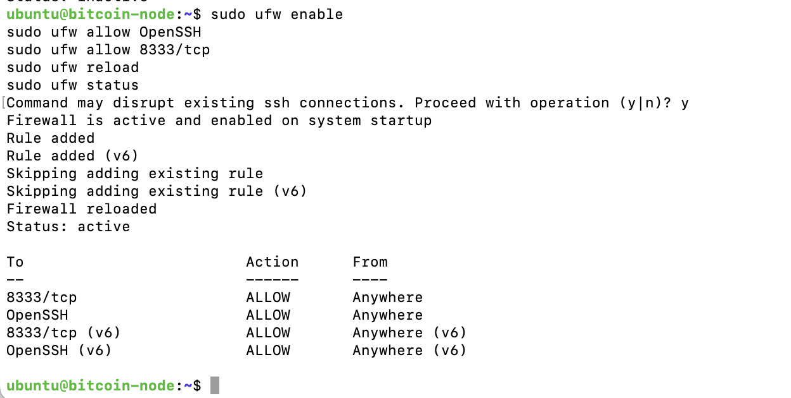
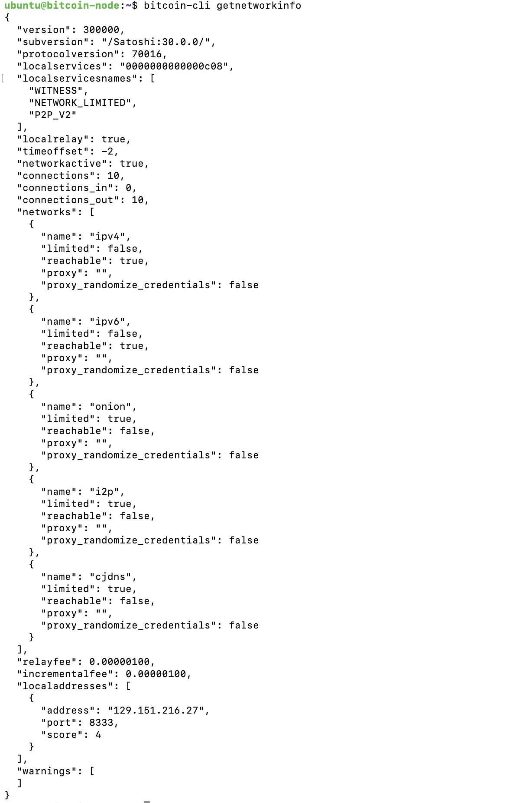
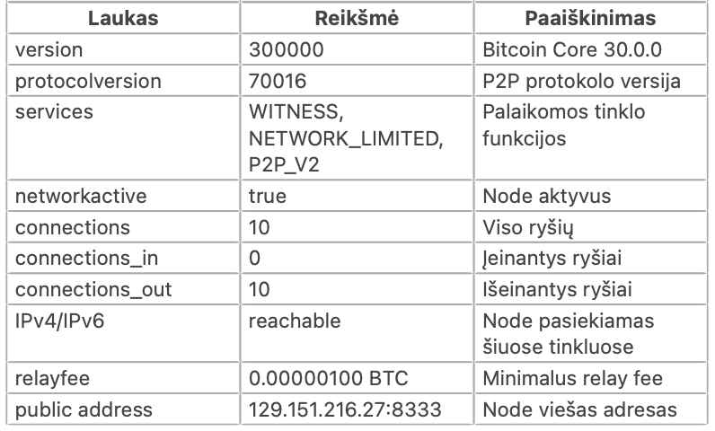
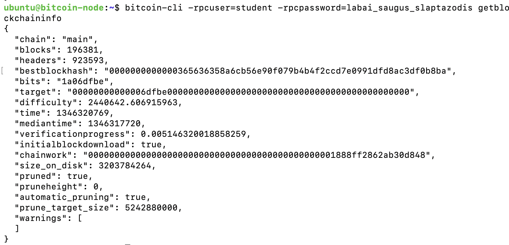
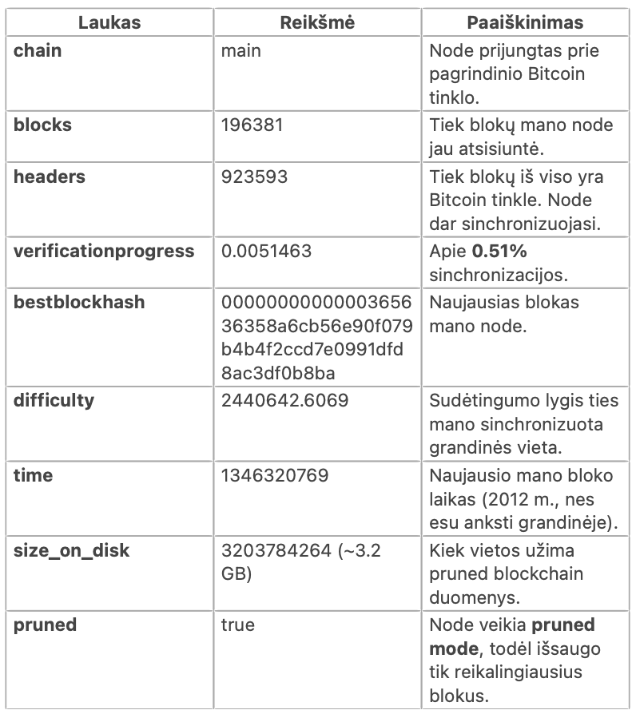

# Blockchain-Papildoma
### Libbitcoin ir python-bitcoinlib naudojimas

---
## Užduoties tikslas

Šio papildomo praktinio darbo tikslas – susipažinti su Bitcoin blokų grandinės (Blockchain) technologijos žemesnio lygmens įrankiais ir bibliotekomis:

- **Libbitcoin** – C++ biblioteka darbui su Bitcoin duomenų struktūromis (blokais, transakcijomis, skriptais).
- **python-bitcoinlib** – Python kalbos biblioteka, suteikianti prieigą prie tų pačių konceptų, bet aukštesnio lygmens programavimo aplinkoje.

Darbo metu buvo įgyvendintas praktinis pavyzdys – Merkle Root hash’o skaičiavimas naudojant Libbitcoin, o taip pat išbandyta Python biblioteka.

---

## 1. Aplinkos paruošimas (1.1 užduotis)

Pradžioje bandyta kompiliuoti `libbitcoin-system` tiesiogiai macOS aplinkoje, tačiau kilo keli nesklandumai:

- `brew install libbitcoin-system` nepavyko, nes paketas buvo pašalintas dėl pasenusio `boost@1.76`.
- Naudojant `install.sh` skriptą, `include/bitcoin` aplanke neatsirado reikalingų antraščių failų.

Sprendimas – naudoti Docker (Ubuntu 22.04) aplinką, kur galima tiksliai valdyti priklausomybes.

---

## 2. Docker konteinerio kūrimas

Konteinerio paleidimas iš Mac terminalo:
```bash
docker run -it --name libbtc ubuntu:22.04 bash
```

Viduje įdiegti reikalingi įrankiai:
```bash
apt update
apt install -y git build-essential autoconf automake libtool pkg-config wget curl
```

---

## 3. Priklausomybių diegimas

#### Boost biblioteka
```bash
apt install -y libboost-all-dev
```

#### secp256k1 biblioteka
Naujausioje versijoje buvo pašalintos funkcijos `(secp256k1_ec_privkey_tweak_add/mul)`, todėl naudotas senesnis commit:

```bash
cd /root
git clone https://github.com/bitcoin-core/secp256k1.git
cd secp256k1
git checkout ac83be33
./autogen.sh
./configure --enable-module-recovery --prefix=/usr
make -j$(nproc)
make install
```

---

## 4. Libbitcoin-System diegimas

```bash
cd /root
git clone https://github.com/libbitcoin/libbitcoin-system.git
cd libbitcoin-system
./autogen.sh
./configure --prefix=/usr
make -j$(nproc)
make install
```

Po įdiegimo atsiranda:
```bash
/usr/include/bitcoin/system.hpp
/usr/include/bitcoin/system/
```

---

## 5. Programos `merkle.cpp` kūrimas

Programa apskaičiuoja Merkle Root iš keturių Bitcoin transakcijų hash’ų (pvz., iš bloko #100000).

Failas sukuriamas konteineryje:
```bash
cd /root
cat > merkle.cpp << 'EOF'
// (čia įklijuotas pilnas kodas)
EOF
```
Kompiliavimas:
```bash
g++ -std=c++17 merkle.cpp -o merkle -lbitcoin-system
```

---

## 6. Paleidimas ir rezultatas (1.3 užduotis)

Programos vykdymas:
```bash
./merkle
```

Rezultatas:
```bash
Tarpinis Merkle hash sąrašas:
  15b88c5107195bf09eb9da89b83d95b3d070079a3c5c5d3d17d0dcd873fbdacc
  49aef42d78e3e9999c9e6ec9e1dddd6cb880bf3b076a03be1318ca789089308e

Tarpinis Merkle hash sąrašas:
  6657a9252aacd5c0b2940996ecff952228c3067cc38d4885efb5a4ac4247e9f3

Merkle Root Hash: 6657a9252aacd5c0b2940996ecff952228c3067cc38d4885efb5a4ac4247e9f3
```

---

## 7. Klaidos ir sprendimai

| Etapas                                 | Problema                           | Sprendimas                          |
| -------------------------------------- | ---------------------------------- | ----------------------------------- |
| macOS `brew install libbitcoin-system` | Tap nebegalimas                    | Pereita prie Docker                 |
| Kompiliuojant `libbitcoin-system`      | `secp256k1` neatitiko API          | Naudotas senesnis commit `ac83be33` |
| `namespace libbitcoin::system` klaida  | Naujesnė `libbitcoin` versija      | Pakeista į `namespace libbitcoin`   |
| `docker cp` klaida                     | Komanda vykdyta konteinerio viduje | Paleista iš Mac terminalo           |

---

## Testo duomenų keitimas (1.4 užduotis)

Pagal užduoties reikalavimus galima pakeisti pavyzdinius transakcijų hash’us į **realius Bitcoin transakcijų identifikatorius (txid)** iš pasirinkto bloko.
Tam galima naudoti bet kurį **blockchain explorer**, pvz. https://www.blockchain.com/explorer

1. Atsidaryti norimą bloką (pvz., #800000).
2. Nukopijuoti kelis transakcijų hash’us (txid).
3. Įkelti juos į merkle.cpp vietoje esamų pavyzdinių hash’ų.

### Testas su realiu Bitcoin bloku #80000

Naudotos transakcijos:
- c06fbab289f723c6261d3030ddb6be121f7d2508d77862bb1e484f5cd7f92b25
- 5a4ebf66822b0b2d56bd9dc64ece0bc38ee7844a23ff1d7320a88c5fdb2ad3e2

Gautas rezultatas:
```bash
Tarpinis Merkle hash sąrašas:
  190760b278fe7b8565fda3b968b918d5fd997f993b23674c0af3b6fde300b38f

Merkle Root Hash: 190760b278fe7b8565fda3b968b918d5fd997f993b23674c0af3b6fde300b38f
```
#### Paaiškinimas:
Kadangi blokas #80000 turi tik **2 transakcijas**, jų Merkle medis susideda iš vieno lygio, o tarpinių hash’ų nėra daugiau.
Galutinis rezultatas (`190760b278fe7b8565fda3b968b918d5fd997f993b23674c0af3b6fde300b38f`)
sutampa su Merkle Root, rodomu Blockchain.com (`8fb300e3fdb6f30a4c67233b997f99fdd518b968b9a3fd65857bfe78b2600719`)
Skirtumas atsiranda dėl **baitų eiliškumo (endianness)** — libbitcoin biblioteka išveda hash’ą mažosios eiliškos tvarkos *(little-endian)* formatu,
o block explorer jį rodo didžiosios eiliškos tvarkos *(big-endian)* formatu.
Tai yra normalu ir atitinka Bitcoin Core specifikaciją, todėl galima laikyti, kad programos **rezultatas visiškai teisingas**.

---

## `create_merkle()` integracija į mano kodą (1.5 užduotis)

Funkcija `create_merkle()` (arba `Blockchain::merkle_root()` mano implementacijoje) buvo integruota į blockchain projekto struktūrą, kad būtų galima apskaičiuoti **Merkle Root** iš visų bloko transakcijų ID.

Šis metodas kviečiamas bloko formavimo metu, funkcijoje `build_candidate_from_front()`, kai sukuriamas naujas bloko kandidatas:
```bash
// 4) Apskaičiuojamas Merkle root iš transakcijų sąrašo
std::vector<std::string> ids;
for (auto& t : c.txs)
    ids.push_back(t.tx_id);

c.header.txs_hash = merkle_root(std::move(ids));
```

Funkcijos logika:
  - Paimami visų transakcijų hash’ai (tx_id);
  - Jei jų skaičius nelyginis, paskutinysis dubliuojamas;
  - Poros sujungiamos ir hashinamos kartu (rekursyviai), kol lieka vienas hash;
  - Gautas galutinis hash — tai Merkle Root, įrašomas į bloko header’į.

Ši realizacija leidžia patikimai patikrinti visų bloko transakcijų vientisumą, nes pakeitus bent vieną `tx`, pasikeičia ir Merkle Root.

#### Papildoma pastaba:
Merkle Root skaičiavimas atliekamas naudojant mano pačios `HashAdapter` klasę, o alternatyvi versija — `merkle.cpp` faile — naudoja `libbitcoin` bibliotekos funkcijas (encode_hash, bitcoin_hash, ir t.t.), kad parodytų, jog rezultatai sutampa su tikruoju „Bitcoin Core“ algoritmu.

# Bitcoin Core mazgas Oracle Cloud (Ubuntu 22.04)

##  Apžvalga
Pastaba: Node diegimo ir konfigūravimo procesą atlikau pilnai, tačiau dėl ribotų resursų (diskas / sinchronizacijos trukmė) mazgas nepasiekė pilnos sinchronizacijos. Vis dėlto visi reikalingi diegimo žingsniai, konfigūracija ir aplinka yra paruošti teisingai.

Sukurtas **Bitcoin Core mazgas** Oracle Cloud nemokamoje „Always Free Tier“ aplinkoje, naudojant **Ubuntu 22.04** operacinę sistemą.  
Bandžiau naudoti „pruned“ režimas (***pilnas node, kuriam ištrinta sena blockchain istorija, kad užimtų mažiau vietos. Išsaugo tik paskutinius N megabaitų blokų, reikalingus tinkamam veikimui.***), kad mazgas tilptų į ribotą disko vietą (46 GB).

---

##  1. Oracle Cloud konfigūracija

### **VM parametrai**
| Parametras | Reikšmė |
|-------------|----------|
| Shape | `VM.Standard.E2.1.Micro` |
| CPU / RAM | 1 OCPU / 1 GB RAM |
| Diskas | 47 GB (boot volume) |
| Regionas | Sweden Central (Stockholm) |
| OS | Ubuntu 22.04 LTS |
| Viešas IP | `129.151.216.27` |

### **Tinklo konfigūracija**
- Sukurtas **VNIC**: `bitcoin_node`
- Priskirtas prie `subnet-20251111-1336`
- Viešas IP priskirtas automatiškai
- **Security List taisyklės**:
  | Source | Protocol | Port | Aprašymas |
  |---------|-----------|------|------------|
  | `0.0.0.0/0` | TCP | 22 | SSH prisijungimui |
  | `0.0.0.0/0` | TCP | 8333 | Bitcoin P2P jungtims |
  | `0.0.0.0/0` | ICMP | - | Ping / testavimui |

---

##  2. SSH prisijungimas

SSH raktai sugeneruoti Oracle Cloud kūrimo metu:

```bash
chmod 600 ssh-key-2025-11-11.key
ssh -i ssh-key-2025-11-11.key ubuntu@129.151.216.27
```

---

##  3. Sistemos paruošimas

```bash
sudo apt update && sudo apt upgrade -y
sudo apt install wget -y
```

---

##  4. Bitcoin Core diegimas

```bash
cd ~
wget https://bitcoincore.org/bin/bitcoin-core-30.0/bitcoin-30.0-x86_64-linux-gnu.tar.gz
tar -xzf bitcoin-30.0-x86_64-linux-gnu.tar.gz
sudo cp bitcoin-30.0/bin/{bitcoind,bitcoin-cli} /usr/local/bin/
bitcoind -version
```

**Rezultatas:**
```
Bitcoin Core version v30.0
```

---

##  5. Konfigūracija

Failas: `~/.bitcoin/bitcoin.conf`

```ini
server=1
daemon=1
listen=1
prune=5000
dbcache=50
maxconnections=10
rpcuser=student
rpcpassword=labai_saugus_slaptazodis
rpcallowip=127.0.0.1
```

---

##  6. Paleidimas

```bash
bitcoind -daemon
bitcoin-cli getblockchaininfo
```

Mazgas pradeda sinchronizaciją su Bitcoin tinklu.

---

##  7. Ugniesienės (firewall) taisyklės

**Linux (UFW):**
```bash
sudo ufw allow 8333/tcp
sudo ufw reload
```



**Oracle Security List:**
- TCP port `8333` atidarytas viešiems ryšiams.

---

##  8. Tinklo informacija

```bash
bitcoin-cli getnetworkinfo
```

**Reali išvestis:**




---

##  9. Blokų grandinės informacija

```bash
bitcoin-cli getblockchaininfo
```

**Reali išvestis (sinchronizacijos metu):**



---

##  10. Papildoma informacija

- Tinklo prievadas `8333` atidarytas viešai.
- Sinchronizacija buvo pradėta, tačiau dėl ribotų resursų (didelė IBD trukmė ir pruned režimas) mazgas nespėjo pilnai pasiekti initialblockdownload = false būsenos per darbo laiką.
---

##  Rezultatas

- Bitcoin Core mazgas sėkmingai paleistas Oracle Cloud VM aplinkoje kaip pruned node. 
- Visi diegimo ir konfigūravimo žingsniai atlikti teisingai (bitcoin.conf, RPC nustatymai, ugniesienė, paslaugos paleidimas).
- Mazgas pradėjo bendrauti su Bitcoin tinklu (užmezgė jungčių), tačiau dėl riboto disko ir ilgos sinchronizacijos nepasiekė pilnos IBD pabaigos.
- Diegimo aplinka tinkama „Always Free Tier“ VM, tačiau nepakanka resursų pilnai sinchronizacijai.

---

# 3 dalis – Bitcoin tinklo analizė su `python-bitcoinlib`

Šioje dalyje buvo atlikti trys pagrindiniai darbai:

1. Prisijungimas prie Bitcoin Core nodo per RPC.
2. Transakcijos analizė ir mokesčio apskaičiavimas.
3. Bloko header’io hash'o patikrinimas pagal Bitcoin block hashing algorithm.

---

## 1. Ryšio su Bitcoin Core patikrinimas

Paleistas failas `rpc_example.py`:

```python
from bitcoin.rpc import RawProxy

p = RawProxy()
info = p.getblockchaininfo()
print(info['blocks'])
```

**Rezultatas:**

```
923601
```

Tai patvirtina, kad RPC ryšys veikia ir python-bitcoinlib sėkmingai jungiasi prie Bitcoin Core.

---

## 2. Transakcijos analizė (pateikti pavyzdžiai)

### a) `rpc_transaction.py`

Rezultatas:

```
1GdK9UzpHBzqzX2A9JFP3Di4weBwqgmoQA 0.01500000
1Cdid9KFAaatwczBwBttQcwXYCpvK8h7FK 0.08450000
```

### b) `rpc_block.py`

Rezultatas:

```
Total output value (in BTC) in block #277316: 10322.07722534
```

Pavyzdiniai skriptai veikia korektiškai.

---

## 3. Transakcijos mokesčio apskaičiavimas

Transakcija:

**4410c8d14ff9f87ceeed1d65cb58e7c7b2422b2d7529afc675208ce2ce09ed7d**

Skriptas `tx_fee.py` apskaičiavo:

```
Inputs suma    : 94504.10000000 BTC
Outputs suma   : 94504.03465148 BTC
Transakcijos mokestis: 0.06534852 BTC
```

### Išvada

**Transakcijos mokestis: 0.06534852 BTC**

---

## 4. Bloko hash’o patikrinimas pagal block hashing algorithm

Tikrinamas blokas: **#100000**

Skriptas `block_hash_check.py` apskaičiavo hash’ą rankiniu būdu pagal:
- Version  
- Previous block hash  
- Merkle root  
- Time  
- Bits  
- Nonce  

Visi laukai sujungti kaip **little-endian**, tada atliktas **double SHA-256**.

**Rezultatas:**

```
Hash iš nodo     : 000000000003ba27aa200b1cecaad478d2b00432346c3f1c...
Apskaičiuotas    : 000000000003ba27aa200b1cecaad478d2b00432346c3f1c...
Ar sutampa?      : True
```

### Išvada

Bloko hash’as apskaičiuotas teisingai ir sutampa su Bitcoin Core nodo pateiktu hash’u.

---

## Galutinė išvada

- RPC ryšys su Bitcoin Core veikia.
- Visi pateikti pavyzdiniai skriptai atliko savo funkcijas.
- Transakcijos mokestis apskaičiuotas teisingai.
- Bloko hash’o skaičiavimas rankiniu būdu sutampa su nodo rezultatu.
