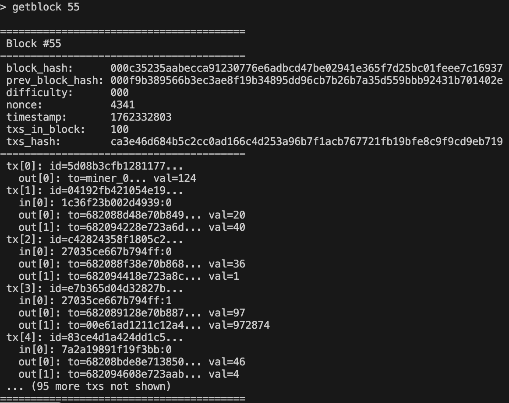
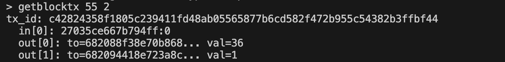
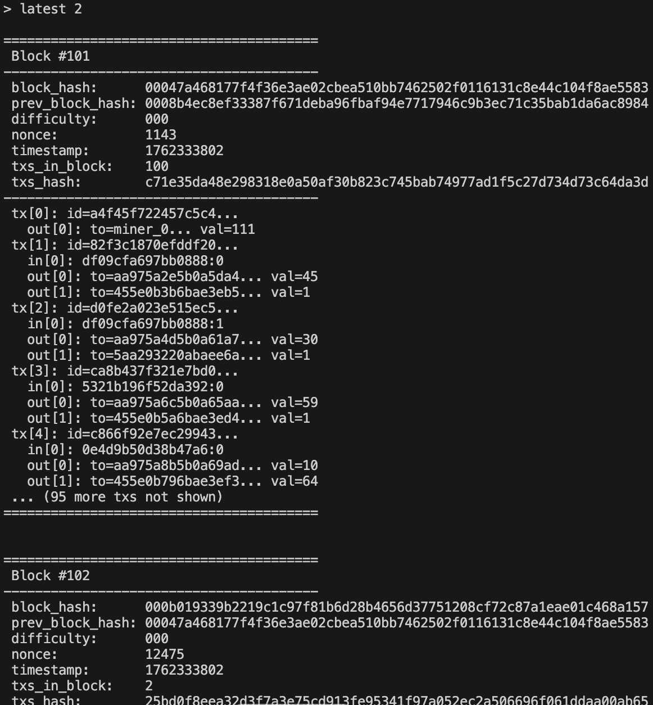
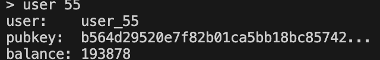

# Blockchain-2
# Supaprastinta blokų grandinė (Blockchain v0.2)

Tai yra **Bitcoin‑stiliaus blockchain** realizacija C++ kalba.  
Tikslas — suprasti kaip *iš tikro* veikia blokų grandinė, išardant ją iki atomų.

## Projektas apima:

| Funkcija | Aprašymas |
|---|---|
UTXO modelis | Transakcijų balanso tikrinimas
Mempool sistema | Transakcijų eilė
Proof‑of‑Work | Reikia rasti nonce → hash su nuliais
Coinbase TX | Nauji pinigai kasėjui
Fee sistema | Už TX kasėjui sumokama
Halving | Reward mažėja kas 50 blokų
Merkle Tree | Patikrinama transakcijų vientisumas
CLI | Galima tikrinti bloką / TX / balansą
Multi-candidate mining | (v0.2) 
Parallel kasimas su thread'ais ir stop flag | (v0.2) 

---

## Blokų grandinės komponentai

```
+---------------------+
|      Blockchain     |
|---------------------|
| chain (blocks[])    |
| mempool (tx queue)  |
| UTXO set            |
| difficulty          |
+---------+-----------+
          |
          |
+---------v-----------+
|      Mining         |
|---------------------|
| build candidates()  |
| PoW (nonce loop)    |
| multi-thread race   |
+---------+-----------+
          |
+---------v-----------+
|     Ledger/UTXO     |
|---------------------|
| validate tx inputs  |
| update balances     |
| prevent double spend|
+---------------------+
```

---

## Projekto STRUKTŪRA

```
include/
    blockchain.h
    hash_adapter.h
src/
    blockchain_state.cpp      ← UTXO / balanso logika
    blockchain_mining.cpp     ← PoW ir kasimas
    blockchain_print.cpp      ← gražus blokų spausdinimas
    main.cpp                  ← CLI sąsaja
my_hash/
    hash.cpp                  ← mano hash algoritmas
    hash.h
```

---

## Programos veikimo PRINCIPAS

Blockchain veikia tokiu ciklu:

1. Sukuriamas **genesis blokas**
2. Sugeneruojami vartotojai ir jų pradiniai UTXO
3. Sugeneruojamos transakcijos (mempool)
4. Imamos pirmos `block_size` transakcijos
5. Įdedama speciali `coinbase` transakcija kasėjui
6. Skaičiuojamas Merkle Root
7. Pradedamas PoW (nonce paieška)
8. Suradus tinkamą bloką — jis pridedamas į grandinę
9. Atnaujinamas UTXO rinkinys
10. Kartojama kol mempool tuščias

---

## Objektinio programavimo principai

| OOP principas | Kaip jis panaudotas |
|---|---|
**Enkapsuliacija** | Vidinė būsena (UTXO, mempool, chain) slepiama klasėse. Laukai `private`, prieiga per viešus metodus (`get_balance()`, `get_block()` ir kt.) |
**Atsakomybės atskyrimas (SRP)** | Kiekviena klasė/modulis turi aiškią rolę: `Blockchain` – valdo grandinę, `Mining` – kasimas, `State` – UTXO ir balansai, `Print` – išvedimas, `main.cpp` – CLI |
**RAII / Automatinė atminties kontrolė** | Naudojami STL konteineriai (`vector`, `deque`, `unordered_map`) ir automatiniai objektai; nėra `new/delete` |
**Const correctness** | Metodai, kurie nekeičia būsenos, pažymėti `const`, pvz. `get_block() const`. Užtikrina saugumą ir aiškumą |
**Move/COPY control** | Dideli objektai nekopijuojami be reikalo; naudojami `const&` ir kur reikia — `noexcept` move operatoriai efektyvumui |
**Modulinė architektūra** | Logika išskaidyta į atskirus failus: `state`, `mining`, `print`, `main`. Lengviau suprasti, palaikyti ir plėsti |

---

## UTXO modelis (kaip Bitcoin)

UTXO = *Unspent Transaction Output* 

### Modelio schema:
```bash
        +-------------------+
        |   UTXO SET        |
        |-------------------|
    TxID:Index -> { owner, amount }
        +-------------------+

Naudojant TX:

Tx Input  -> sunaikina UTXO
Tx Output -> sukuria naują UTXO

```

### Principas

- Pinigai neegzistuoja kaip skaičius sąskaitoje
- Egzistuoja **neišnaudoti išėjimai (UTXO)**
- Transakcija:
  - sunaudoja senus UTXO
  - sukuria naujus

**Taisyklė:** `sum(input) ≥ sum(output)`

### VIZUALIAI:
```
UserA turi: (UTXO#1: 50)

Tx:
 Input:  UTXO#1:50
 Output: to B:30
         to A:20  (grąža)
```

### UTXO klaidos tikrinamos:

- Nėra input UTXO — klaida
- Bandymas išleisti jau panaudotą UTXO — klaida (double spend)
- `sum_out > sum_in` — klaida
- TX ID neatitinka VIN/VOUT hash — klaida (saugumas)

---

## Bloko struktūra

```bash
+---------------------------+
|        Block              |
|---------------------------|
| Header                    |
|  prev_block_hash          |
|  timestamp                |
|  difficulty               |
|  merkle_root              |
|  nonce                    |
|                           |
| Transactions[]            |
|  tx0 = coinbase           |
|  tx1, tx2, ...            |
+---------------------------+
```

Paaiškinimai:

| Laukas            | Paaiškinimas                                            | Kodėl svarbu                                                 |
| ----------------- | ------------------------------------------------------- | ------------------------------------------------------------ |
| `prev_block_hash` | Nuoroda į ankstesnį bloką                               | Užtikrina grandinės vientisumą — negalima pakeisti istorijos |
| `timestamp`       | UNIX laikas, kada blokas sukurtas                       | Laiko seka + apsauga nuo pakartotinio naudojimo              |
| `difficulty`      | Kiek nulinių bitų turi prasidėti bloko hash             | Nustato kasimo sudėtingumą ir tinklo saugumą                 |
| `merkle_root`     | Hash iš visų transakcijų bloko viduje                   | Užtikrina, kad nė viena TX negali būti pakeista              |
| `nonce`           | Skaičius, kurį kasa miner'iai, kad gautų tinkamą hash | Proof-of-Work — garantuoja, kad *difficulty* atitinka      |
| `Transactions[]`  | Visos bloko transakcijos                                | Perduoda monetų valdymą (UTXO sunaudojami ir sukuriami nauji)                                 |
| `tx0 = coinbase`  | Speciali transakcija — bloko atlygį gauna kasėjas       | Sukuria naujus coin'us + surenka fees                        |
| `tx1, tx2...`     | Registruoja pinigų judėjimą tarp vartotojų (sumažina siuntėjo balansą ir padidina gavėjo balansą)                        | Užtikrina teisingą balansų apskaitą ir transakcijų istoriją                      |

---

## Proof‑of‑Work (PoW)

**Proof-of-Work (PoW)** yra algoritmas, kuris užtikrina, kad naujas blokas būtų **sukurtas tik atlikus realų skaičiavimo darbą**.
Tai apsaugo tinklą nuo piktavalių ir dvigubo išleidimo (double-spend).

#### Tikslas:
Rasti tokį `nonce`, kad:
```
hash(block_header) prasidėtų difficulty (pvz. "0000")
```
Tai vadinama **kasimu**, nes kompiuteris turi "iškasti" tinkamą nonce vertę.

#### Pseudokodas:
```
nonce = 0
do {
    hash = HASH(header + nonce)
    nonce++
} while (hash does not start with "000...")
```
#### Ką garantuoja PoW?
| Užtikrina        | Ką reiškia                                          |
| ---------------- | --------------------------------------------------- |
| Decentralizaciją | Bet kas gali kasti, nėra centrinio valdovo          |
| Saugumą          | Kad pakeisti bloką, reikia perkasti visus sekančius |
| İntegnumą        | Nė vienas negali į tinklą įterpti suklastotų blokų  |
| Anti-spam        | Blokų kūrimas kainuoja energiją / laiką             |

### VIZUALIAI:
```BASH
Header + Nonce ---> HASH ---> Prasideda "000"? → Taip → Blokas tvirtas
                          \→ Ne → nonce++
```
---

## Transakcijos

Transakcijos šiame projekte modeliuoja **pinigų judėjimą tarp vartotojų**, panašiai kaip Bitcoin tinklo transakcijos.

### Kas yra transakcija?
Transakcija nurodo:
  - kas siunčia lėšas (`sender`)
  - kam siunčiamos lėšos (`receiver`)
  - kiek monetų siunčiama (`amount`)
  - iš kur pasiimamos lėšos (UTXO input'ai)
  - į kokius naujus UTXO jos išskaidomos (output'ai)

Trumpai — tai **nuosavybės perleidimo instrukcija**.

#### TX generavimas:
Programa automatiškai sukuria `N` transakcijų:
  - Pasirenkamas atsitiktinis siuntėjas (su likučiu)
  - Pasirenkamas atsitiktinis gavėjas
  - Parenkama atsitiktinė suma (pvz. 1–100 monetų)
  - Surenkami siuntėjo UTXO padengti sumai
  - Sukuriami išėjimai: gavėjui + grąža siuntėjui
  - Apskaičiuojamas transakcijos ID (hash)

#### Schema:
```bash
Inputs (UTXO) ----> Transaction ----> New Outputs (UTXO)
```

---

## Transakcijos ID (TXID)

Kad transakcijos būtų unikalios ir neklastojamos, joms sugeneruojamas hash:
```
TXID = HASH( inputs + outputs + amount + nonce + timestamp )
```
Naudojama mano **custom hash funkcija**.

#### Kodėl reikia TXID?
TX ID yra:
  - transakcijos identifikatorius (kaip serijos numeris)
  - nuoroda į UTXO input'us
  - įrodymas, kad transakcija nebuvo pakeista

TXID veikia kaip skaitmeninis **parašas ir štampas viename**.

---

## Mempool

Sugeneruotos transakcijos **patenka į mempool** — laukiančių transakcijų eilę:
```
TxPool = { tx1, tx2, tx3, ... }
```
Mineris pasiima pirmas `block_size` transakcijų ir bando sudėti jas į bloką.

#### Pseudokodas:
```
for i in range(N):
    sender   = random user with UTXO
    receiver = random different user
    amount   = random(1..100)

    inputs = pick UTXO that cover amount
    outputs = {
        receiver: amount,
        sender: change_if_any
    }

    tx.tx_id = hash(inputs + outputs + timestamp)
    mempool.push(tx)
```

---

## Transakcijų mokesčiai (Fees)

Kiekviena transakcija turi fiksuotą mokestį — `1 coin`
  - Mokesčiai keliauja į miner coinbase reward'ą
  - Tai imituoja tikrą Bitcoin fee sistemą

--- 

## Genesis blokas

Pirmas blokas grandinėje — **genesis blokas**.
Jis sukuriamas programos pradžioje ir neturi tėvinio bloko.

Savybės:
  - prev_hash = 0...0 (visi nuliai)
  - Nėra realių transakcijų (arba tik speciali inicializacijos TX)
  - Nekasamas — nonce gali būti 0 (PoW nepritaikomas)
  - Tarnauja kaip grandinės pradžia ir atskaitos taškas

Išvestis:
```
[chain] genesis block created (height=0)
```

#### VIZUALIAI:
```
+----------------------------------+
|          GENESIS BLOCK          |
+----------------------------------+
| prev_block_hash: 000000...0000  |  <- nėra tėvinio bloko
| timestamp:       <start time>   |
| difficulty:      <set value>    |
| nonce:           0              |  <- PoW nekasamas
| merkle_root:     GENESIS        |  <- nėra tikrų TX
+----------------------------------+
| transactions[]                  |
|   [0] GENESIS_TX (pradiniai UTXO) |
|   - sukuria pradinius pinigus   |
|   - paskirsto vartotojams       |
+----------------------------------+
```

---

## Coinbase + Halving

**Coinbase transakcija** — tai pirmoji transakcija bloke.
Ji neturi input'ų, nes **sukuria naujas monetas** (kaip Bitcoin).

Kaip ji veikia?
  - Į kiekvieną bloką automatiškai įdedama pirma transakcija coinbase
  - Ji prideda reward kasėjui (miner_0 arba kitam miner’iui, jei bus daugiau)
  - Coinbase monetos niekada neturi siuntėjo (input = GENESIS)

#### Halving mechanizmas

Monetų sukūrimas laikui bėgant mažėja, kad valiuta nebūtų infliacinė.
```
Reward start: 50
Kas 50 blokų → reward = reward / 2
Minimalus reward = 1
```

Išvestis:
```
tx[0]: id=900aee8f43f7...
out[0]: to=miner_0 val=12
```
- Miner’is iškasė bloką
- Gavo 12 monetų reward

---

## Merkle Root

Tikrinimo medžio šaknis iš visų `tx_id`.  
Užtikrina vientisumą — pakeitus bet kurią TX, keičiasi root.

### VIZUALIAI:
```BASH
TX0   TX1   TX2   TX3
 |     |     |     |
H0    H1    H2    H3
 |__ __|     |__ __|
   H01        H23
     |________|
        Root

Jei nelyginis → dubliuojam:

TX0 TX1 TX2
H0  H1  H2 H2  (duplicate last)
```
---

## CLI režimas

Pasibaigus automatiniam kasimui, programa pereina į interaktyvų režimą.
Čia galima **apžiūrėti blokų grandinę, transakcijas, balansus ir mempool**.

Komandos:

| Komanda             | Aprašymas                                               |
| ------------------- | ------------------------------------------------------- |
| `help`              | Parodo pagalbos tekstą                                  |
| `exit`              | Išeina iš CLI                                           |
| `getblock <height>` | Parodo bloką pagal aukštį (0 = genesis)                 |
| `gettx <txid>`      | Rodo transakciją + jos UTXO input'us ir output'us       |
| `latest [n]`        | Rodo paskutinius `n` blokų (numatytai 5)                |
| `mempool [n]`       | Rodo pirmas `n` mempool transakcijų (numatytai 5)       |
| `balance <pubkey>`  | Rodo vartotojo balansą pagal public key                 |
| `user <i>`          | Parodo i-to naudotojo informaciją (name/pubkey/balance) |

---

## v0.2 Lygiagretus kasimas (Multi‑Candidate Mining)

### v0.1

- 1 blokas generuojamas vienu metu
- 1 nonce ciklas

```
vienas kandidatas → ieškome nonce → radom
```

### v0.2

- Kuriami `num_candidates` nepriklausomi blokai
- Kiekvienam suteikiamas `max_ms` laikas
- Laimi pirmas radęs PoW

### Idėja:
```
5 kandidatų blokai
↓
visi bando rasti nonce
↓
pirmas rado → laimėjo → kiti nutraukiami
```

### VIZUALI EIGA:
```BASH
 ┌─────────────┐
 | Mempool TXs |
 └──────┬──────┘
  (take N)
       ↓
┌──────────────┐   spawn threads   ┌──────────────┐
| Candidate #1 |------------------>| Miner Thread |
└──────────────┘                   └──────────────┘
┌──────────────┐                   ┌──────────────┐
| Candidate #2 |------------------>| Miner Thread |
└──────────────┘                   └──────────────┘
┌──────────────┐                   ┌──────────────┐
| Candidate #3 |------------------>| Miner Thread |
└──────────────┘                   └──────────────┘
┌──────────────┐                   ┌──────────────┐
| Candidate #4 |------------------>| Miner Thread |
└──────────────┘                   └──────────────┘
┌──────────────┐                   ┌──────────────┐
| Candidate #5 |------------------>| Miner Thread |
└──────────────┘                   └──────────────┘

         winner!
            ↓
     commit → chain
```

### STOP mechanizmas:
```
atomic<bool> stop = false

if (thread finds PoW) {
    stop = true  // kiti sustoja
}
```

Argumentas:

```
--parallel
```

Tai imituoja realų tinklą, kur **kelios kasyklos konkuruoja**.

---

##  Paleidimas

### Įprastas

```bash
./blockchain 5000 50 0000
```

### Lygiagretus (v0.2)

```bash
./blockchain 5000 50 0000 --parallel
```

### Parametrai

| Argumentas | Reikšmė |
|--|--|
| 1 | transakcijų skaičius |
| 2 | bloko dydis (tx per bloką) |
| 3 | difficulty (nuliai stringe) |
| `--parallel` | aktyvuoja v0.2 |

---

## Hash funkcija

Naudojama custom hash:
- bubble sort + salt
- 256‑bit sėkla
- kiekvienas baito keitimas keičia visą hash

Hash adapteris konvertuoja į blockchain formatą.


## Pavyzdinė kosoles išvestis

```
[mining] nonce=11071 hash=00065418e72b9ee3...
[mined] block found! nonce=11071...
[mined] block found! cand=2 nonce=18560 hash=0000ca928daa118a...

```
### Bloko peržiūra (`getblock`)



### Transakcijos peržiūra bloke (`getblocktx`)



### Naujausi blokai (`latest 2`)



### Vartotojo informacija (`user 55`)



### Balanso peržiūra (`balance user_55`)


---

## Išvados

Šiame projekte sukurta veikianti supaprastinta blokų grandinė, paremta pagrindiniais Bitcoin principais:

### Pagrindiniai pasiekti tikslai

- Įgyvendintas **UTXO modelis** vietoje paprastos balanso lentelės — tai suteikia tikrovišką lėšų valdymą kaip Bitcoin tinkle.
- Sukurtas **Proof-of-Work algoritmas** su reguliuojamu sudėtingumu (`difficulty`) ir nonce paieška.
- Pridėtas **coinbase atlygis mineriui** ir **halving mechanizmas**, mažinantis reward'ą kas nustatytą blokų skaičių.
- Realizuota **mempool sistema**, kurioje laikomos nepatvirtintos transakcijos, ir logika joms patekti į bloką.
- Sukurtas **tikras Merkle Root** skaičiavimas, užtikrinantis transakcijų vientisumą bloke.
- Integruotas **lygiagretus (parallel) kasimas su kelių blokų kandidatais (v0.2)**, imituojantis decentralizuotą kasybos lenktynių mechanizmą.

### Rezultatas

Projektas aiškiai parodo:

- kaip formuojami blokai
- kaip tikrinamos ir taikomos transakcijos
- kaip vyksta konkurencija tarp „mazgų“
- kaip veikia UTXO, PoW ir Merkle Root grandinėje
- kaip atlygis mažėja laikui bėgant (halving)

## Sistemos ribotumai ir trūkumai

Nors projektas realizuoja pagrindines blockchain idėjas, jis turi supaprastinimų ir ribotumų:


### Techniniai ribotumai
- **Vieno mazgo sistema** — nėra tikro P2P tinklo, visi procesai vyksta lokaliai.
- **Nėra pilno transakcijų parašų (ECDSA)** — UTXO modelis veikia, bet nėra realios kriptografinės vartotojų autentifikacijos.
- **Nėra blokų propagacijos ir tikro fork sprendimo** — lygiagretus kasimas simuliuotas, bet nėra tinklo konsensuso logikos.
- **Mempool prioritetas supaprastintas** — transakcijos nevertinamos pagal fee ar dydį, atrenkamos tiesiog iš eilės.
- **Fiksuotas bloko dydis** — nėra dinaminio limito ar dydžio optimizavimo.

### Funkciniai ribotumai
- **Ekonomika supaprastinta** — nėra transaction fee rinkos ar mempool konkurencijos.
- **Nėra smart contract palaikymo** — tik bitcoin-stiliaus transakcijos.
- **Nėra tinklo vėlavimo, paketų praradimo simuliacijos** — todėl nėra tikro race conditions tarp mazgų.

### Sauga
- **Nėra apsaugos nuo DoS / spam transakcijų** — realus tinklas reikalautų fee + minGasLimit.
- **Privatumo nėra** — visa transakcijų informacija atvira kaip Bitcoin UTXO modelyje.

### Našumas
- **PoW CPU-only ir vieno proceso** (lygiagretūs tik kandidatai, ne realūs mazgai)
- **Nėra mempool limitų** — galima įdėti neribotai transakcijų RAM'e.

---

## AI pagalba

Šiame projekte AI buvo naudojamas kaip pagalbinė priemonė, skirta:
- paaiškinti blockchain teorinius principus (UTXO, PoW, Merkle Trees, halving)
- padėti susiplanuoti architektūrą ir funkcijų sąrašą
- pasiūlyti geresnę projekto struktūrą (atskirti state/mining/CLI/print logiką)
- paaiškino pažangesnius C++ konceptus:
  - `std::atomic<bool>` ir `memory_order_relaxed`
  - thread structūra
  - `std::lock_guard<std::mutex>`
- kodo optimizavimo rekomendacijoms (pvz. `std::atomic`, `reserve()`, lock scope)
- debug'inti kraštutinius atvejus (pvz. mempool netvarkingumą, nonce overflow)
